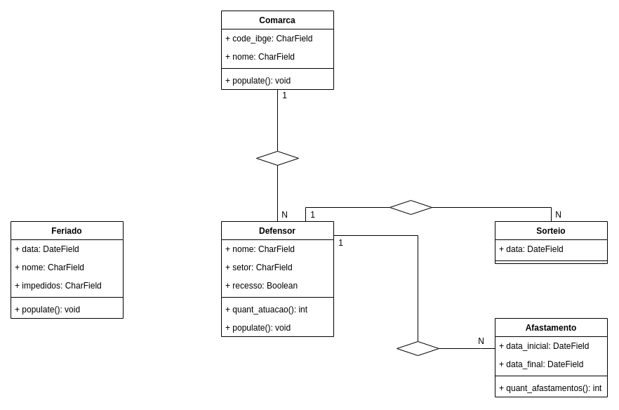

# Plantões

Sistema de Sorteio de Defensores Públicos para Plantões diversos na Defensoria Pública do Piauí.

<hr>

## :bulb: Motivação

Todos os anos um sorteio é realizado para definir a alocação dos defensores do estado do Piauí nos dias da semana, sendo assim a escala de todos os defensores é criada com base na disponibilidade de horário dos mesmos no ano. Todos os defensores de uma comarca participam do sorteio da comarca em que ele está inserido, por exemplo, defensores da comarca de Teresina participam do sorteio das comarcas de Teresina e os Defensores da Comarca de Campo Maior participam do sorteio da comarca de Campo Maior.

### :heavy_check_mark: Regras gerais para os sorteios

Antes de explicar as regras vamos entender os tipos de sorteio disponíveis no momento.

1. Sorteio aleatório de defensores para a alocação no ano;
2. Sorteio de defensores para o recesso (nomalmente definido de 20/12 à 06/01 do ano seguinte);
3. Sorteio de defensores para os interiores;
    * Esse tipo de sorteio leva em conta a regra dos blocos (Vai ser apresentada a seguir).
5. Sorteio de defensores das audiências de custódias dos finais de semana e feriado;
6. Sorteio do recesso de Parnaíba (Segue uma regra diferente dos demais recessos; Vai ser apresentado a seguir).


#### Sorteio aleatório de defensores

Essa modalidade de sorteio é aplicada à capital Teresina, o sorteio é realizado para todo os dias do ano e para cada dia um defensor é sorteado caso não haja nenhum impedimento para a alocação.

**Regras para o sorteio**

1. Um defensor não pode ser alocado em um período de afastamento;
2. Se o defensor estiver alocado no recesso no ano anterior o mesmo não poderá ser alocado no recesso desse ano;
3. Um defensor não pode ser alocado dois dias seguidos.
4. O sorteio deve ser o mais igualitário possível, por mais que a sorte sejs levada em conta nesse caso.

#### Sorteio de defensores para o recesso

As regras abaixo são aplicada de forma geral para todas as comarcas.

**Regras para o sorteio**

1. Se o defensor estiver no afastamento o mesmo não poderá ser alocado;
2. Se o defensor estiver alocado no recesso no ano anterior o mesmo não poderá ser alocado no recesso desse ano (se o atributo recesso for verdadeiro então o defensor não pode ser alocado no recesso);
3. Um defensor não pode ser alocado dois dias seguidos no recesso.

#### Sorteio de defensores para o interior

As regras abaixo são aplicadas aos interiores por conta da quantidade menor de defensores para serem sorteados, portando o único sorteio para ser realizado é o sorteio do recesso e segue a seguinte lógica.
O recesso normalmente dura 18 dias, se a comarca tiver 3 defensores para serem sorteados, então será 6 dias para cada, dessa forma o sorteio é realizado uma vez e o defensor vai ser alocado nos seis dias seguintes.
Por exemplo: Em **São Raimundo Nonato** há 3 defensorias, então o resultado do sorteio seria algo equivalente ao resultado abaixo, no sorteio a 3° DPE foi a primeira a ser sorteada, a 2° DPE foi a segunda a ser sorteada e por fim a 3° DPE.

```
- Bloco 01 - 
20/12/2021	3ª DPE
21/12/2021	3ª DPE
22/12/2021	3ª DPE
23/12/2021	3ª DPE
24/12/2021	3ª DPE
25/12/2021	3ª DPE
- Bloco 02 - 
26/12/2021	2ª DPE
27/12/2021	2ª DPE
28/12/2021	2ª DPE
29/12/2021	2ª DPE
30/12/2021	2ª DPE
31/12/2021	2ª DPE
- Bloco 03 - 
01/01/2022	1ª DPE
02/01/2022	1ª DPE
03/01/2022	1ª DPE
04/01/2022	1ª DPE
05/01/2022	1ª DPE
06/01/2022	1ª DPE
```

#### Sorteio para as audiências de custódia (Parnaíba)

No momento, em Parnaíba há 10 defensorias atuando, e nós precisamos dividir as audiências de custódias entre as defensorias, as audiências de custódia são sessões de atendimento alocadas nos finais de semanas e feriados, não é necessário a atuação de todas as defensorias nesse período.
Os dias que serão sorteados estão definidos no período de atendimento anual que vai de 07/01 à 19/12 do mesmo ano.

| Data                                                   | Defensor |
|--------------------------------------------------------|----------|
| 11/01/2020 à 12/01/2020                                | 3° DPE   |
| 18/01/2020 à 19/01/2020                                | 6° DPE   |
| 25/01/2020 à 26/01/2020                                | 7° DPE   |
| 01/02/2020 à 02/02/2020                                | 9° DPE   |
| 08/02/2020 à 09/02/2020                                | 1° DPE   |
| 15/02/2020 à 16/02/2020                                | 8° DPE   |
| Feriado de carnaval 22/02/2020 à 23/02/2020            | 2° DPE   |
| Feriado de carnaval 24/02/2020 à 26/02/2020            | 4° DPE   |
| 29/02/2020 à 01/03/2020                                | 5° DPE   |
| 07/03/2020 à 08/03/2020                                | 10° DPE  |

Observe que no exemplo acima os 10 defensores foram sorteados sem serem repetidos no dias seguintes, isso quer dizer que o sorteio das audiências de custódias são realizadas de acordo com o númedo de defensorias, no exemplo acima de 10 em 10, somente depois de 10 sorteios um defensor pode ser sorteado novamente.
Oberve também no feriadão um defensor será sorteado para atuar naquele dia, somente se o mesmo tiver disponibilidade para atuar nessa data (não há afastamento e também o mesmo não atuou nessa data no ano anterior).

## Modelo da aplicação



## :information_source: tecnologias utilizadas

O desenvolvimento dessa solução utiliza as seguintes tecnologias.

* 
* 

## :rocket: Instalação

```bash
# Clone o projeto
git clone https://github.com/PedroHenriqueDevBR/Plantoes.git
cd Plantoes

# Crie um ambiente virtual
python3 -m venv venv
source venv/bin/activate

# Instale os requsitos
pip install -r requirements.txt

# Rode a aplicação
python manage.py migrate
python manage.py runserver
```
